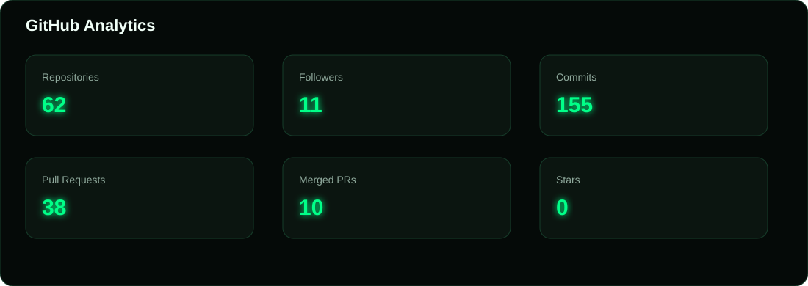
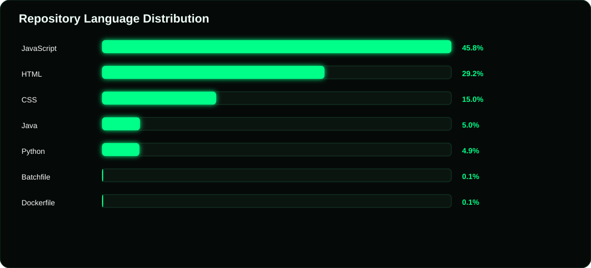
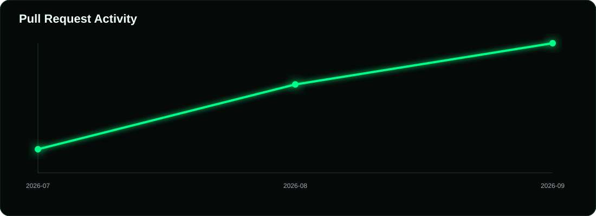

  

## Open Source Contribution 
<!--START_MERGED_PRS-->

**🔀 21 Total PRs**
&nbsp;&nbsp; • &nbsp;&nbsp;
**🟢 6 Merged PRs**

<table width="100%">

<tr>
<td>

 **feat(cognito): implement user MFA preferences**

</td>

<td align="right">

</td>
</tr>

<tr>
<td>

 **fix(cloudformation): resolve IAM assume role policy intrinsics**

</td>

<td align="right">

</td>
</tr>

<tr>
<td>

 **fix(bedrock-agentcore): allow maxResults up to 1000**

</td>

<td align="right">

</td>
</tr>

<tr>
<td>

 **fix: preserve Firehose compression format in CloudFormation**

</td>

<td align="right">

</td>
</tr>

<tr>
<td>

 **fix: keep tracking alive after malformed SSE chunks**

</td>

<td align="right">

</td>
</tr>

<tr>
<td>

 **Warn when static HTML parser dependencies are unavailable**

</td>

<td align="right">

</td>
</tr>

</table>

Showing latest 6 of 6 merged pull requests
&nbsp; • &nbsp;

<!--END_MERGED_PRS-->

AI Engineer focused on machine learning, deep learning, and generative AI systems, with a full-stack foundation spanning React, Node.js, and cloud-native backends. Actively growing an open-source footprint — contributing pull requests, reviewing issues, and collaborating on AI/ML repositories.

### `Tech-Stack/`

**Languages & Frontend**
 

**Backend**
 

**AI / ML**
 

**Cloud & Databases**
 

**Tools**
 

### `Github-Analytics`

### `Language-Graph`

### `Activity`

### `Snake`

*"Building intelligent systems, one commit at a time."*

